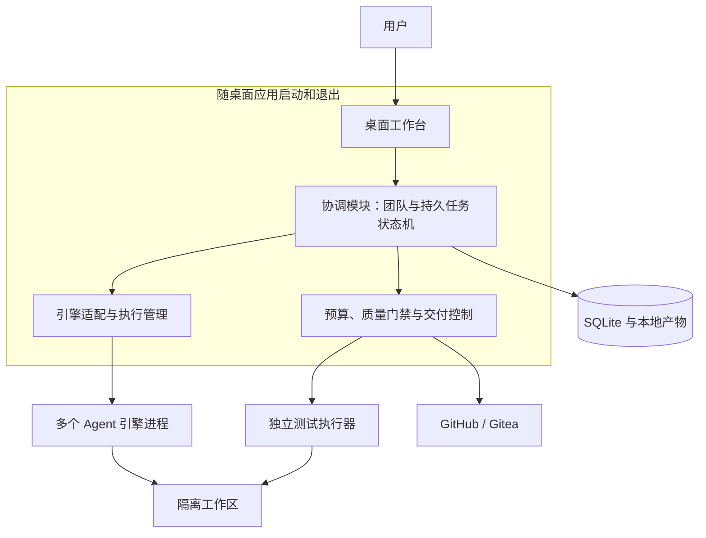
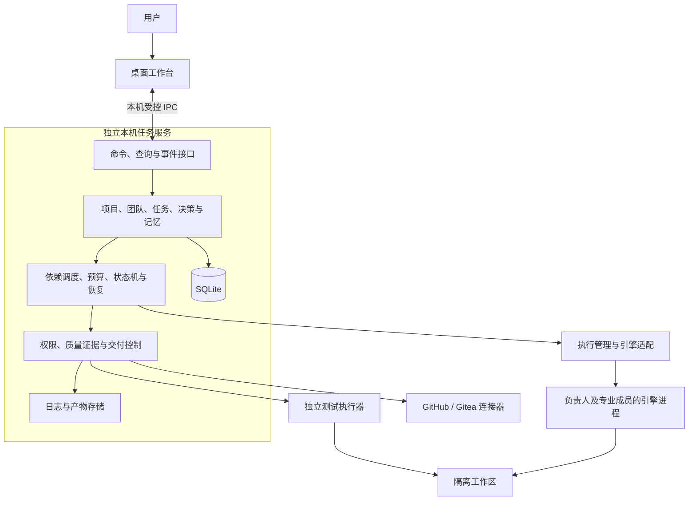
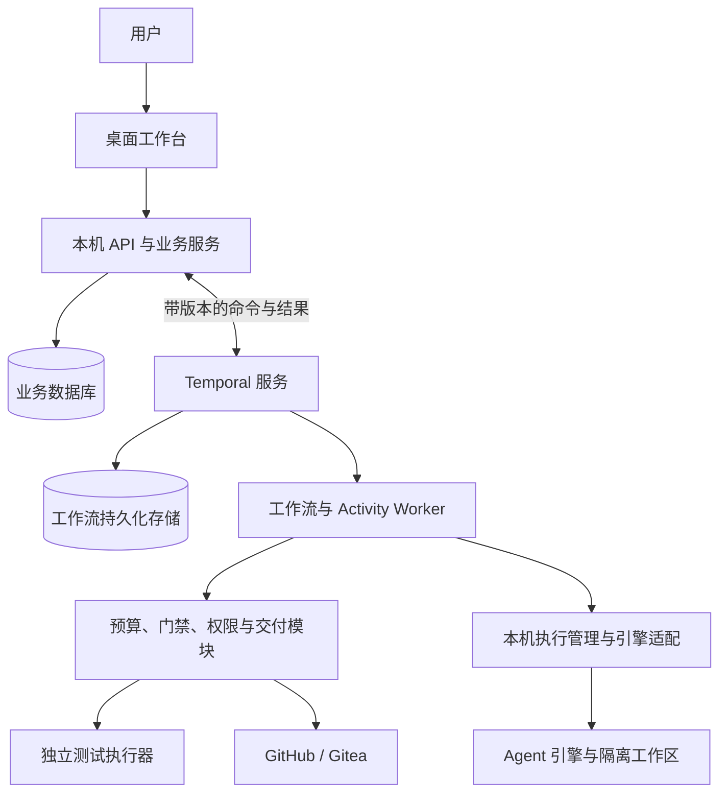

# 人机协作多 Agent 编程平台：三个架构方案

日期：2026-09-12。状态：**用户已选定方案二：桌面 + 本机常驻任务服务。** 下文保留选型时的比较与建议；后续以 [ADR-001](adr/001-local-service.md) 和[实施设计](architecture.md)为准。

依据：[需求访谈草案](product-requirements-draft.md)、[已选 nano-harness 验收场景](nano-harness-acceptance-candidates.md)。本文把已确认需求转为设计建议；技术栈、进程边界、故障处理和具体契约均尚未成为用户决定。

## 1. 先看结论

**建议以方案二“桌面 + 本机常驻任务服务”作为讨论基础。**

你的使用方式是：给固定团队方向，让它持续完成需求、开发、测试、检视与返工，主要在方向选择、合入主干和发布时参与。这使任务的持续性、质量证据和执行控制，比对话窗口本身更影响架构。方案二把工作保存在独立本机服务中，同时保持个人桌面产品的安装规模。

这个推荐有一个尚待确认的前提：希望退出桌面应用后，本机上的团队仍能继续工作。如果更重视最快得到一个可用版本，并接受任务随应用退出而暂停，方案一更有吸引力；如果近期就确定要多机器执行、多人使用和长期复杂调度，方案三值得提前承担基础设施成本。

| 比较项 | 方案一：一体化桌面应用 | 方案二：桌面 + 本机任务服务 | 方案三：持久工作流引擎 |
| --- | --- | --- | --- |
| 工作由谁推进 | 应用内协调模块 | 独立本机服务 | Temporal 工作流与 Worker |
| 任务保存在哪里 | 本地 SQLite | 本地 SQLite | 业务库 + Temporal 执行历史，各司其职 |
| 完全退出桌面应用 | 暂停执行，再打开时恢复核对 | 服务继续执行 | 服务和 Worker 继续执行 |
| 电脑休眠或关机 | 本机工作停止 | 本机工作停止 | 本机部署时同样停止 |
| 崩溃后的恢复 | 自建状态机与外部状态核对 | 自建持久任务调度与外部状态核对 | 引擎恢复流程；外部动作仍需核对 |
| 固定团队、并行、TDD、门禁 | 都支持 | 都支持 | 都支持 |
| 分发与升级负担 | 相对最低 | 中等，需管理服务生命周期 | 相对最高，需管理工作流服务、数据库和 Worker |
| 第一版主要难点 | 生命周期耦合、恢复逻辑 | 把有限的调度与恢复机制做可靠 | 工作流建模、幂等、版本兼容和服务运维 |
| 更适合 | 先验证产品交互和完整交付流程 | 个人长期使用的自主编程团队 | 已有明确多机或组织级路线 |

以上复杂度是架构判断，未经过实现或性能测量，不是工期承诺。三个方案都可以先在本机执行，并不要求把代码上传到新的平台服务器；所选模型服务和代码托管仍按用户配置连接。

## 2. 三个方案共有的产品骨架

三个方案使用相同的业务边界，差异主要在任务执行的生命周期和调度基础设施。

| 模块 | 负责的事情 | 关键边界 |
| --- | --- | --- |
| 桌面工作台 | 决策收件箱、负责人对话、团队群聊、成员私聊、任务与成果 | 所有入口读写同一份任务和决策记录 |
| 团队与知识 | 固定成员身份、职责、项目知识、长期偏好、经验来源 | 成员身份独立于模型、进程和会话 |
| 团队负责人 Agent | 澄清、提出计划、分配成员、解释分歧、推动交付 | 提出结构化动作，不能自行改写门禁结论 |
| 任务控制 | 依赖、优先级、并发、预算、状态变更、等待和恢复 | 用确定性程序验证动作是否获准执行 |
| 引擎接入 | 对接现有 CLI/SDK、自建引擎，转译事件和控制命令 | 明确能力差异，不能把缺失能力伪装成支持 |
| 工作区与执行 | 代码隔离、进程生命周期、工具授权、测试环境 | 一份可写工作区同时只有一个执行所有者 |
| 质量与证据 | TDD、测试、独立检视、CI、版本和产物关联 | 成功结论来自实际执行证据 |
| Git 与交付 | 分支、PR、CI 查询、合并、发布准备 | 主干合并和实际发布分别需要人的决定 |

负责人可以按证据调整计划、补充任务和安排返工。程序限制的是权限、预算与阶段准入条件，不要求所有项目都走一张事先画死的任务图。

## 3. 方案一：一体化桌面应用

### 结构



**技术建议**：Electron + React/TypeScript；协调模块置于应用管理的 Node.js utility process；SQLite 保存任务、决策和证据索引，文件目录保存大日志与产物。业务模块分开，整体随一个桌面应用分发。Electron 本身采用多进程架构，因此“一体化”描述部署与生命周期，不表示全部逻辑放在一个进程。[Electron 进程模型](https://www.electronjs.org/docs/latest/tutorial/process-model)

**任务如何运行**：负责人产出任务依赖图；协调模块持久化计划并分配执行槽；各成员通过引擎适配器执行；门禁模块验证证据并安排返工。固定团队身份存于数据库，无须为每个成员永久运行一个模型进程。

**退出与恢复**：关闭窗口可以保留托盘运行；完全退出应用时，先停止派新任务、请求中断活动执行并记录结果。异常退出后重新启动，先核对进程、工作区、会话和远端 PR，再决定恢复或重试。不能只因数据库里写着“运行中”就再启动一份。

**优势**：安装入口少，界面和协调逻辑可以共享 TypeScript 类型，最容易尽早验证完整产品体验。它也能实现严格门禁和可靠持久化，不能简单视为演示版。

**代价**：应用更新、完全退出与执行生命周期相互影响；恢复逻辑仍需自己实现。以后拆出常驻服务，必须调整 IPC、进程所有权、升级和恢复机制。

**选择条件**：接受“应用运行时团队工作”，首阶段最重视快速验证体验，对无人值守的持续执行要求相对低。

## 4. 方案二：桌面 + 本机常驻任务服务（推荐）

### 结构



**技术建议**：Electron + React/TypeScript 桌面；Go 本机服务；SQLite + 文件产物库；JSON 结构化命令与事件，通过 Unix socket 或 Windows named pipe 等本地通道传输。具体操作系统和传输库待定。

Go 是结合现有 Go 项目和本机进程管理需求提出的候选，并非架构必要条件；独立 TypeScript 服务也能采用相同边界。应先确定是否需要独立任务服务，再定语言。

**任务如何运行**：服务拥有项目状态、调度和所有执行记录；桌面负责呈现与输入。负责人是可唤醒的成员，由服务把相关事件、当前目标和证据组成上下文交给它，收到计划后由程序验证并执行。等待人或 CI 时持久化等待条件，释放模型调用和可释放的执行槽。

**任务服务保持一个部署单元**：团队、任务、预算、门禁、记忆和 Git 连接器首先作为内部模块实现，不拆成多个业务微服务。调度只实现本产品需要的依赖、定时重试、等待、取消和恢复，不做通用工作流语言。

**数据持久化**：业务状态、审计事件和待发送事件在同一个数据库事务中提交；事件发送后可以重试，由接收者去重。采用关系表保存当前状态，不要求从所有历史聊天重放整个系统。SQLite 由服务统一管理写入，事务保持短小；WAL 适合本地读写并行，但仍只有一个并发写者，也不适合作为多机共享网络盘数据库。[SQLite WAL 文档](https://sqlite.org/wal.html)

**退出与恢复**：服务独立于桌面进程运行。关闭或退出桌面后任务继续；服务停止、电脑休眠或重启后按持久状态核对恢复。服务升级要先停止派发、收拢运行进程，再执行兼容的数据迁移；UI 与服务的协议版本必须能够检测不匹配。

**优势**：最贴近“团队持续工作，人在需要判断时回来”的交互；本机即可运行，不引入工作流服务器。以后加入第二个客户端或远程执行器时，桌面和核心业务边界较稳定。

**代价**：需要做好服务安装/卸载、日志、升级、退出控制和故障恢复。持久任务调度由自己维护，最容易出错的是重复执行、旧进程继续写入和证据过期，必须专项验证。

**选择条件**：以个人本机使用为主，但希望固定团队能持续推进较长任务；愿意承担一个后台服务的产品和工程成本。

## 5. 方案三：桌面 + 成熟持久工作流引擎

### 结构



**技术建议**：沿用桌面和 Go 业务层；Temporal Go SDK + Temporal 服务；PostgreSQL 保存业务数据，并以独立数据库/受支持的部署配置承载 Temporal 持久化；本地文件保存日志和产物。首版本机部署即可，容器是一种分发选择，不要求 Kubernetes。

**任务如何运行**：交付目标下建立有界工作流，子工作项对应任务；工作流负责等待、超时、重试和协调，Agent 决策、Git、文件与模型请求通过 Activity/执行器发生。人的决定通过持久消息送达。Temporal 的 Workflow 有确定性要求，外部 API 和文件操作需要放在 Activity 等适当边界中。[Workflow 约束](https://docs.temporal.io/develop/go/workflows/basics)、[工作流消息](https://docs.temporal.io/develop/go/workflows/message-passing)

**状态边界**：业务数据库是需求、决策、预算与质量证据的权威来源；Temporal 历史负责流程执行位置和等待条件。业务事务通过待发送事件传递已提交的决定，工作流按事件 ID 和版本去重。不能让两边分别裁定“是否获准合并”。大日志只传引用，避免塞进工作流历史。

**退出与恢复**：界面退出不影响工作。工作流可以根据历史恢复调度，但已经发生的 Git 推送、模型调用和工具写入仍需要幂等键或外部状态核对。不能把工作流恢复等同于“所有外部动作恰好执行一次”。等待数小时的 Agent 进程仍需执行管理器监管，不能用一个无限重试的 Activity 包住整个项目。

**优势**：流程持久化、长等待和重试有成熟基础，面向未来多个 Worker、远程执行与复杂交付流程更自然。

**代价**：个人桌面软件需要额外管理服务器、数据库、Worker 和工作流版本；产品自己的质量规则、引擎差异、外部动作恢复仍要开发。开发用本地服务器适合验证，不直接当作正式产品的服务部署方案。[Temporal 自托管指南](https://docs.temporal.io/self-hosted-guide)

**选择条件**：多机器、组织协作或复杂长流程已经是近期确定需求，且接受额外运维与分发成本。单纯希望未来“可能扩展”还不足以证明值得首版引入。

## 6. 三个方案都必须解决的关键机制

以下是建议采用的业务设计，不因选择不同调度基础设施而消失。

### 6.1 负责人有判断空间，平台保存执行权

负责人和专业成员提交结构化建议，例如创建工作项、分配成员、补充验收标准、提交修改、申请验证、提出分歧。程序核对成员身份、目标版本、依赖、预算和权限，再推进状态。

成员身份由平台绑定运行实例，不能相信模型输出中自行填写的“我是评审者”。测试成功由受控执行器记录；人工授权由经过用户交互确认的决策记录产生；模型消息不能直接把任务标为已通过门禁或已获人类批准。

任务采用可持久化的状态机与依赖图。发现新证据可以调整计划，返工以新执行尝试记录。等待某一项人的决定只冻结相关依赖分支，其他获准任务继续。反复失败达到预算或重试策略边界时，负责人汇总尝试与选项，避免成员之间无限循环。

### 6.2 固定成员、任务与引擎会话分开

建议的最小数据模型如下，属于领域概念而非已经确定的数据库表设计。

| 对象 | 需要记录的核心事实 |
| --- | --- |
| Project / GoalRevision | 仓库、目标、范围、方向版本、验收标准版本 |
| Member / EngineBinding | 固定身份、职责、引擎与模型配置、能力清单 |
| Task / Run | 稳定工作项、依赖、负责人；每次尝试的引擎会话、执行代次和结果 |
| ChangeSet | 工作区、作者集合、基线、代码快照、PR 与候选提交 |
| GatePolicy / Evidence | 生效规则版本；RED/GREEN、测试、CI、评审、日志与环境关联 |
| Review / Finding | 独立评审者、目标版本、问题、修复与复核结果 |
| DecisionRequest / Decision | 待判断事项、选项与影响、用户决定、作用范围和失效条件 |
| Budget / Reservation | 总授权、并发配额、运行前预留、实际或估算用量 |
| Memory | 内容、来源、个人/项目/成员范围、确认状态、替代和撤销记录 |
| ReleaseCandidate / Artifact | 版本、源提交、构建环境、文件摘要、验证结果、发布决定 |

长期成员可以按需唤醒，更换引擎后沿用平台身份与已确认知识。模型上下文由目标、当前任务、相关决策、必要证据和记忆组成，不把完整群聊不断复制给所有成员。

负责人对话、群聊、私聊和任务视图共享一份领域状态。直接向开发成员提出新方向时，形成版本化变更并通知相关负责人；不能在聊天窗口里悄悄覆盖另一处任务要求。群聊按参与者和相关工作路由消息，不让每条消息都唤醒全体成员。

记忆保留来源：明确长期偏好自动保存，推断偏好待确认；一次性意见绑定当前事项。用户能查看、纠正和撤销，最新适用的显式决定优先于旧经验。首版可用结构化条目和全文检索，是否需要向量检索由实际召回问题决定。

### 6.3 TDD 与门禁要有版本化证据

建议把验证结果绑定到以下内容：

```text
目标与验收版本 + 门禁规则版本
代码快照/候选提交 + 基线提交 + 测试集摘要
测试入口与执行器版本 + 工具链/环境标识
执行结果 + 原始日志引用 + 时间 + 执行实例
```

工作树快照要覆盖实际参与执行的文件，包括未跟踪测试文件和子模块版本，不能只有 HEAD 哈希。正式候选在干净、可重建的工作区验证。

**TDD 的建议实现**：先在受控的测试编写阶段捕获新增测试和有效 RED，再开放相应实现阶段；GREEN 与该测试集关联，重构后再验证。失败要能解释为目标行为缺失或缺陷存在，不能用无关环境失败代替。测试本身发生变化时重新判断原 RED 是否仍然有效。

事后将实现拿掉、重跑测试，只能证明测试有检出能力，不能单独证明开发实际遵循了测试先行。对于无法观察或限制写入阶段的黑盒引擎，界面必须说明 TDD 过程证据不足；不能宣称与可核验的测试先行等价。可将“先产出测试、由平台验证，再运行实现阶段”作为兼容路径，并验证相应工作区权限。

**门禁执行**：开发成员可以运行测试辅助调试；计入交付门禁的结果由独立执行器从冻结的候选快照产生。规则基线、结果写入接口和证据库由平台控制。修改当前分支中的 Makefile 或 CI 文件不能自动替换已批准的门禁政策；要核对实际测试入口、测试发现数量、退出状态和报告，不能只看一句“通过”。

**独立检视**：评审成员检查需求、差异、测试与风险；同一个变更的任一作者都不能批准该变更，即使换了角色或模型。发现问题后形成 Finding，修改导致相关检查失效，复核绑定新版本。不同成员可使用相同模型，但不能把作者总结当成独立评审结果。

**规则变更**：在目标范围内增加覆盖和验证可以自主进行；放宽要求需要人判断。对“是否放宽”不能可靠自动判定的语义修改，保留差异并独立检视，疑似降低标准时提交人的决策。程序保证证据与流程一致，测试充分性仍需要专业判断。

### 6.4 并行、授权和预算

**工作区**：每个并行变更使用独立 worktree 或独立克隆，测试端口、临时目录和数据实例分别分配。依赖任务基于明确版本启动；集成时对组合后的结果重新验证。Git worktree 提供多个工作目录，但共享部分仓库数据，本身不是安全沙箱。[git-worktree 文档](https://git-scm.com/docs/git-worktree)

**执行权限**：按项目、任务和阶段分配读写路径、命令与网络能力；平台数据和合并/发布凭据应位于执行进程不可访问的边界之外。这需要首发操作系统及引擎支持的实际沙箱、容器或等效隔离。仅把文件放在另一个目录、设置同用户权限，不能阻止具有同等主机权限的进程访问它们。平台应标明实际隔离能力。

**三类授权分别保存**：项目常规操作授权、具体工具的一次性审批、人的产品/合并/发布决定。项目预授权内的可核验操作由程序处理，使常规开发无需频繁问人；预算扩张、标准放宽、合并和发布不能由工具审批代替。任意 shell 字符串也不能只凭模型写的理由就自动放行，应依赖可检查的操作和受限执行环境。

**预算**：并发额度和运行额度在派发前原子预留，负责人在总授权内分配。用量分为“已测量、估算、不可获取”，包含协调、评审与返工。订阅制 CLI 或无实时计量的引擎不能承诺精确费用硬上限，应按用户选择采用时间、调用/尝试次数和并发限制，或限制自动使用。停止派发不能撤销已经发生的模型调用费用。

桌面渲染层不直接拥有执行和仓库权限，只能通过有限 IPC 提交命令；具体实现需启用隔离并验证 IPC 来源。[Electron 安全文档](https://www.electronjs.org/docs/latest/tutorial/security)

### 6.5 引擎接入采用能力契约

建议的平台适配器逻辑接口：建立/恢复会话、提交工作、订阅事件、回答工具审批、请求中断、关闭会话、读取用量。它是平台内部接口，不要求所有引擎实现同一套原生 API。

每个适配器声明协议版本和实际能力：事件是否结构化、能否续读、中断范围、恢复到什么边界、审批是否含完整操作信息、用量可见性、文件/网络隔离、原生子 Agent 是否可观察。

优先采用引擎已有的正式 SDK 或结构化协议；ACP 可作为适用引擎的接入候选，仍需核对各实现能力。[ACP 协议概览](https://agentclientprotocol.com/protocol/v1/overview) 仅有终端文本的引擎可以提供受限体验，但不能把文本抓取当作完整审批、恢复或质量证据。MCP 工具接入与编程 Agent 的会话控制是不同边界。

适配器事件带平台 Run ID、引擎会话 ID、序号/游标和请求关联 ID。重复事件去重，缺失事件触发核对。保存必要执行记录与决策依据，不依赖获取模型的隐藏思维过程。

### 6.6 GitHub / Gitea 和人的最终 review

本地验证与 Agent 检视通过后，平台可以推送分支并创建 PR。远端 CI 失败进入自动修复循环；必需检查通过后，整理成果预览、验收结果、评审问题处置、风险、费用和差异，生成合并决策项。

合并授权绑定 PR、候选提交、目标分支基线、验收/门禁版本和证据集合。授权之后改代码，或者目标分支更新导致验证基线变化，必须重新验证并生成新的授权请求。多个 PR 合并按目标分支串行处理；每次基线变化都检查依赖结果。

平台调用合并 API 时使用候选提交条件，并结合托管平台的严格分支保护/合并队列等能力防止过期合并。仅在本地“检查后马上合并”不能消除远端其他操作者造成的竞争；实际连接器无法保证时，应明确阻塞或要求受保护的合并路径。

GitHub 与 Gitea 连接器分别核验版本、权限、分支保护和实际 CI 状态，不能假设两个产品行为相同。平台仅把真实满足政策的检查计入通过；GitHub 原生规则可能接受 skipped/neutral 状态，需要额外判定。Gitea Actions 与 GitHub Actions 存在差异，包括 environment 的支持，发布授权应由平台明确保存。[GitHub 分支保护](https://docs.github.com/en/repositories/configuring-branches-and-merges-in-your-repository/managing-protected-branches/about-protected-branches)、[Gitea 分支保护](https://docs.gitea.com/usage/access-control/protected-branches/)、[Actions 差异](https://docs.gitea.com/usage/actions/comparison/)

Agent 内部交叉检视不自动等于托管平台的原生 PR approval。个人仓库要明确 PR 的创建身份与人类评审身份，防止同一账户无法完成自身 PR 的必需审批。由机器人创建 PR、用户评审是一种候选；最终取决于实际托管权限配置。

合并后基于实际版本准备发布说明、构建产物及其摘要和验证清单，交付状态为“可发布”。发布授权另行绑定这份候选清单。产物过期、重建或版本变化后重新验证；不能用旧快照的通过记录覆盖另一套发布二进制。

### 6.7 故障和变更如何收敛

| 发生的情况 | 建议行为 |
| --- | --- |
| 用户修改方向 | 建立目标新版本，分析影响；停止或调整相关任务，保留不受影响的工作 |
| 等待人判断 | 持久保存问题、选项和依据；相关分支等待，独立分支继续 |
| 测试/CI 失败 | 保留失败证据，安排诊断和修复；重试通过不能抹掉已有失败或擅自忽略 flaky 测试 |
| 模型超时或限流 | 有界退避、调整引擎或等待；受总预算与承诺约束 |
| 服务崩溃或进程失联 | 先核对旧进程和引擎会话；确认停止或收回写权限后才转交工作区 |
| 旧执行迟到上报 | 按执行代次拒收过期结果；这只能保护平台状态，不能撤销已发生的文件或远端操作 |
| 推送/建 PR 后连接中断 | 用稳定分支、请求标识和远端查询确认是否已完成，不盲目重复创建 |
| 工具动作结果未知 | 先查看文件、进程或远端事实；无法判断且重试可能造成不可逆影响时升级处理 |
| 数据库与产物备份 | 使用一致的数据库备份方式并关联产物清单；不只复制正在使用的数据库主文件 |

所有方案都要区分“重新接上仍在运行的任务”“从引擎检查点继续”“以新尝试重做未完成工作”。不能承诺任意引擎在任意工具调用中间都无损续跑。

## 7. 用 nano-harness 验收场景检验架构

已选目标：**让桌面平台以程序方式调用 nano-harness，提交任务、观察进展、处理审批、中断并恢复会话。**

三种架构均采用相同的业务演练；方案一主要检验应用重启恢复，方案二增加服务与桌面独立生命周期，方案三增加工作流/Worker 故障和版本恢复。

| 阶段 | 成员职责与产出 | 平台应留下的证据 |
| --- | --- | --- |
| 明确需求 | 产品成员形成接口使用场景与验收标准；负责人检查目标范围 | 目标版本、成功条件、未决事项 |
| 比较方案 | 架构成员比较本地传输、协议、生命周期与权限；有方向取舍再交给人 | 可比较方案、决策记录、接口契约 |
| 形成计划 | 负责人安排协议、适配器、运行生命周期与测试任务 | 依赖、成员、预算和资源分配 |
| TDD 开发 | 开发成员做测试先行的小步实现；测试成员独立覆盖验收和异常路径 | 可核验 RED/GREEN 与快照、实际测试报告 |
| 独立检视 | 非作者成员检查协议边界、权限、资源清理和兼容性 | 版本化评审与问题处置记录 |
| CI 和修复 | 提交 PR、接收 CI 结果；相关成员自主修复 | 远端提交、检查来源、重验结果 |
| 人的最终 review | 用户检查成果、证据和取舍，决定是否合并 | 绑定候选版本的明确授权 |
| 准备交付 | 基于合入后的版本构建并验证、整理发布说明 | 候选清单、文件摘要与可发布状态 |
| 接入自建引擎 | 用新增接口注册 nano-harness 适配器并运行契约验收 | 能力清单、真实 binary 端到端结果 |

首个任务由已接入的现有编程引擎实现 nano-harness 接口，然后平台再接入 nano-harness，避免循环依赖。平台固定成员可以分别使用 nano-harness 的独立根会话；不需要先扩张它的内部 delegated session 权限。

从当前源码看，外部接口需要专门澄清以下契约：

- **审批信息**：当前 [approval.Question](/opt/code/ai-workspace/nano-harness/internal/app/approval/service.go:28)包含请求关联、工具名称和理由，没有完整操作参数。要支持平台受控预授权，需要从内部工具请求提供可校验的具体操作信息，并绑定到一次性决定；仅凭理由文本不足以判断授权范围。
- **中断范围**：当前内部 Interrupt 面向活动工作，不能直接把它解释为清空整个任务的后续队列。接口需要区分中断本次执行、取消排队输入和关闭会话。
- **恢复语义**：复用现有持久事件与恢复能力，同时明确异常退出时工具结果未知的处理；不承诺任意运行位置续跑。
- **原有边界**：复用当前审批策略和 TUI 路径；外部接口不自动允许写入，也不顺带扩张子 Agent 权限。新增入口继续遵守仓库的分层与 plugin 生命周期规则。

上述是接口设计输入，不是对 nano-harness 现有代码的修改。本次没有运行测试，也没有宣称当前分支通过门禁。

发布准备还要尊重仓库现状：[release.yml](/opt/code/ai-workspace/nano-harness/.github/workflows/release.yml:59)区分 snapshot 构建和实际版本构建。因此不能将先前 snapshot 二进制直接当作最终发布候选；应绑定真正准备发布的版本和产物。该工作流同一次发布中的构建、校验和上传可沿用同一组产物，平台记录它们的对应关系。

## 8. 选型后应先验证的架构风险

这些是后续实施的验证安排，当前不执行。

1. **真实引擎契约**：选一个实际引擎验证结构化进度、审批元数据、中断、恢复、用量与工作区限制，形成明确能力清单；同时有可控的测试适配器制造超时、重复事件和断开。
2. **恢复不重复执行**：在派发前后、工具完成但结果未落库、PR 已创建但响应丢失等位置注入故障，验证核对和接管行为。
3. **证据不能被过期结果替换**：测试先行、修改后失效、作者不能批准自己、改门禁脚本不能直接绕过规则；人工授权后变更候选必须失效。
4. **平台能够实际约束执行**：验证文件/网络隔离、敏感控制接口不可调用、并发预算预留与取消；不以提示词承诺代替测试。
5. **完成真实交付**：在 nano-harness 案例中运行功能验收与平台流程验收，覆盖自主修复和人工最终 review，记录人工介入、总时间、资源与失败恢复结果。

一个案例能验证闭环是否成立，不能单独证明长期交付成功率。量化目标应在选型后明确，不预先编造可靠性、费用或工期数字。

## 9. 推荐方案二的取舍与演进

推荐理由是它同时匹配当前三个明确方向：个人桌面、本机执行、固定团队承担较长交付过程。它让人离开界面与团队继续执行可以独立，又不用首版就维护工作流集群。

主要风险是自建任务恢复。应限制调度内核范围，优先验证持久状态、执行所有权、结果核对和证据失效；不能用“先存一个任务状态字段”代替恢复设计。若实际流程很快需要复杂跨机调度，且维护恢复机制明显挤占产品工作，应重新评估方案三。

从方案二向方案三演进，可复用领域对象、引擎适配器、证据与 Git 连接器，但任务调度、等待和运行中任务迁移需要专门设计，不能承诺无成本切换。方案一也可以逐步拆成方案二，前提是从一开始就隔离桌面与协调模块的接口。

首版建议聚焦当前已经确认的完整交付闭环。多人权限、远程执行、可视化工作流搭建器、通用插件市场等扩展，等真实需求出现再设计；固定团队身份、状态版本和适配器边界为此保留必要空间。

## 10. 下一轮讨论的决策顺序

1. **先比较架构取舍**：最快形成可用体验、退出桌面仍持续工作、提前具备复杂多机工作流基础，哪一个优先。
2. **选定架构后确定首发环境**：操作系统、首个现有引擎、GitHub/Gitea 适配顺序，以及是否需要与桌面独立的执行主机。本文暂按同机设计。
3. **明确运行契约**：退出、睡眠和重启的行为；预算单位；可自动执行的权限范围；引擎能力缺失时怎样处理。
4. **落成可实施设计**：模块接口、状态转换、证据失效规则、数据版本、nano-harness 接口契约和里程碑验收，形成选型 ADR 后再开始实现。

后续决定：用户已明确选择方案二，进入详细设计与平台基础实现阶段。nano-harness 控制接口仍按既定验收计划开展，不因架构选型而直接修改其代码。
