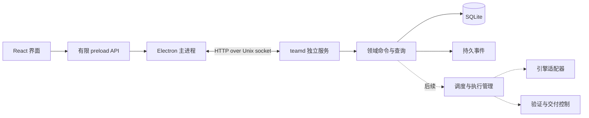

# 方案二实施设计

日期：2026-09-12。架构选择已接受；以下为可迭代的工程设计。完整产品要求见[需求草案](product-requirements-draft.md)，能力进度见[实施计划](implementation-plan.md)。

## 1. 进程与模块

桌面不启动或杀死服务，不直接读数据库，不把任意 HTTP 路径或 shell 能力暴露给渲染层。服务是本地单写者；系统服务注册以后单独交付。开发阶段由用户在独立终端启动服务。

目录边界：`cmd/teamd` 为组合入口；`internal/store` 管理迁移、事务和查询；`internal/api` 提供版本化本地接口；`internal/daemon` 管理 socket、实例锁与退出；`desktop` 为桌面客户端。后续按实际实现加入 `scheduler`、`engine`、`workspace`、`quality`、`forge`，不先创建空实现。

## 2. 权威状态与身份

服务保存 Project、Member、Goal、Task、Run、Decision、Evidence 和 Artifact。初始实现只加入 Project、Member、Goal、Event；后续迁移逐步扩展。成员以稳定 ID 表示负责人、产品、架构、开发、测试、评审六个职责；角色数量可以后续配置。

Goal 记录目标内容和版本。Task 是稳定工作项；Run 是一次尝试，包含引擎会话、执行代次、预算预留与结果。固定成员并非固定进程。未配置真实引擎前 Goal 状态为 `awaiting_engine`，不能视作已排队执行。

每次领域变更与对应 Event 在一个事务中提交。状态表是当前事实，事件用于审计和订阅恢复；不从自由文本重建执行状态。客户端断开后以序号续读事件，快照与游标在同一读取事务内获取。

创建项目/目标携带 `request_id`，数据库保存请求摘要与结果。同 ID 同内容返回原结果，不重复创建；同 ID 不同内容返回冲突。后续状态变更再携带预期实体版本，防止旧界面覆盖新方向。

## 3. 本地接口 v1

| 接口 | 行为 |
| --- | --- |
| `GET /healthz` | 返回服务版本和协议版本 |
| `GET /v1/snapshot` | 原子读取项目、固定成员、目标和事件游标 |
| `GET /v1/events?after=N` | 返回游标之后的有限事件，客户端继续翻页 |
| `POST /v1/projects` | 根据名称和实际本地目录注册项目 |
| `POST /v1/projects/{id}/goals` | 提交目标，初始为等待引擎接入 |

接口只监听 owner-only Unix socket；请求体有大小上限，未知字段和多余 JSON 拒绝，所有错误使用稳定错误码。明确区分非法输入、找不到对象、请求冲突和内部失败。客户端不把超时当成失败已回滚；保留同一个请求 ID 重试。

后续执行事件采用 `run_id`、引擎会话 ID、序号/游标、请求关联 ID、执行代次。平台命令授权来自连接与成员运行上下文，不来自模型自称的角色字段。UI 的用户决定与引擎工具审批使用不同命令入口。

## 4. 数据与生命周期

状态目录位于用户配置目录下的 `multi-agent-team`，权限 0700；数据库、锁和 socket 权限 0600。仅支持该产品自己的专用目录。数据库启用 foreign keys、WAL、FULL 同步和短事务；schema 版本过新时拒绝启动。

服务持有进程级文件锁后才打开数据库和处理遗留 socket。已有活服务时第二个实例拒绝启动；遗留路径若是普通文件而非 socket，不删除它。SIGTERM/SIGINT 停止接收请求，等待当前请求完成后关闭资源，保留状态文件。单独结束桌面进程不触发服务退出。

本地同用户 socket 权限不能隔离具有同等主机权限的 Agent。真实引擎接入前需验证执行沙箱，避免 worker 访问控制 socket、平台数据及合并/发布凭据。第一阶段尚不启动任何 Agent，也不提供执行、合并或发布端点。

## 5. 后续任务状态与恢复契约

| 状态/事件 | 行为 |
| --- | --- |
| `blocked_dependencies` | 保存未满足的依赖，不占执行槽 |
| `ready` | 在权限、能力与预算满足后可被派发 |
| `running` | 唯一 Run 拥有执行代次、工作区及预留预算 |
| `waiting_decision` / `waiting_ci` | 保存等待条件，释放可释放的执行资源 |
| `needs_reconciliation` | 状态未知，核对旧进程和外部动作后才重试 |
| `completed` / `cancelled` | 保留最终证据；取消不代表已撤销外部动作 |

未来按事务领取任务和预算。丢失心跳不能证明进程死亡；旧进程已停止或写权限收回后才能交接工作区。执行代次可拒绝旧结果，不能回滚已发生的 shell/Git 操作。创建 PR 等操作使用幂等标识与远端查询核对。

## 6. 质量与决策契约

质量结论绑定目标/验收版本、门禁规则摘要、代码快照、测试集、运行环境和原始日志。新增行为保留有效 RED → 实现 → GREEN 的过程。独立执行器从冻结候选运行门禁；开发者自述不计为验证结果。

作者集合与评审成员必须不相交。代码、基线或验收版本变化时，受影响的测试与评审失效。人的合并授权再绑定候选提交、目标分支、基线与证据集合；最终由 forge 适配器核对条件并执行。发布授权绑定真实发布产物摘要，不能继承为未来版本的授权。

这套契约是后续必须实现和测试的行为，不代表当前已有门禁引擎。

## 7. 引擎契约与职责分工

逻辑接口包含能力协商、建立/恢复会话、提交工作、事件读取、审批、中断和用量。适配器明确支持程度，不用文本成功提示替代结构化证据。负责人提出任务，产品制定标准，架构比较方案，开发 TDD 实现，测试做独立验收，评审检查变更与证据。

用户已确认首轮同时接入 Codex 与 Claude Code。Codex 候选通道是独立 app-server 的结构化协议；Claude Code 候选通道是 Agent SDK 的流式会话，通过服务拥有的适配进程运行。两者均先做真实契约验证再加入执行调度，不能因一个通过就把双引擎里程碑标记完成。

Claude SDK 的 Node 适配进程由服务启动和监管，不能使用依赖 Electron 生命周期的 utility process。开发阶段可用本机 Node；正式分发需包含经过验证的配套运行时，并纳入服务升级/回滚。引擎契约和接入验收见[双引擎接入设计](engine-contract.md)。

Codex 采用 app-server 以便处理双向审批与会话控制，[官方文档](https://learn.chatgpt.com/docs/app-server)。Claude Code 使用流式输入与运行时权限回调，并核对已有规则的优先级，避免假设所有工具调用都必然经过回调，[流式会话](https://code.claude.com/docs/en/agent-sdk/streaming-vs-single-mode)、[权限规则](https://code.claude.com/docs/en/agent-sdk/permissions)。具体版本、凭据复用方式及实际能力由接入测试确定，当前并未执行模型调用。

nano-harness 外部接口作为第一个完整交付案例，功能完成后再接入，保持原有审批及内部子 Agent 权限语义。

## 8. 技术依据

SQLite 驱动采用固定版本的 [modernc.org/sqlite](https://pkg.go.dev/modernc.org/sqlite)，以 Go 数据库接口实现事务持久化。桌面按 [Electron 安全边界](https://www.electronjs.org/docs/latest/tutorial/security)配置受限 preload 和隔离渲染进程。Node HTTP 客户端通过 socketPath 访问服务，[接口文档](https://nodejs.org/api/http.html)提供对应传输能力。
